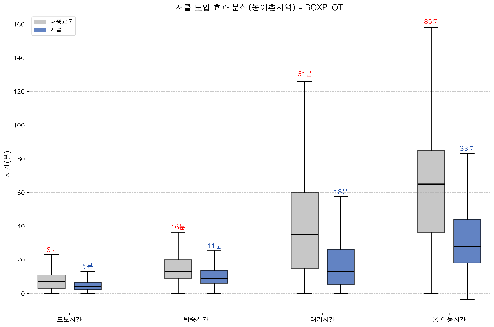

# 셔클 효과 분석 패키지

**셔클(수요응답형 교통서비스) 도입 효과 시각화 및 통계 분석 도구**

## 개요

셔클 도입 전후의 도심 / 농어촌 지역의 교통 편의성이 개선되었는지 확인하는 프로젝트 입니다.

탑승시간, 도보시간, 대기시간, 총 이동시간을 분석하며 Boxplot, Violin Plot, Boxen Plot, Forest Plot을 통한 시각화와 통계적 유의성 검증을 진행하여 개선 효과를 확인합니다.

데이터 분포를 직관적으로 시각화 가능하고, 관찰된 개선 효과가 통계적으로 유의미함을 확인합니다.

## 주요 기능

### 0. 데이터 준비

* 2025년 9월 1일부터 9월 7일까지의 셔클 운행 정보를 활용하여 분석을 진행합니다.
* 셔클 운행 정보에 해당하는 시점, 종점을 기반으로 대중교통 이동경로 및 이동시간을 ODsay API로부터 추출합니다.
* 탑승시간, 도보시간, 대기시간, 총 이동시간을 분석합니다.
* 도시 / 농어촌 지역에 따른 데이터를 분석합니다.

### 1. 시각화 (핵심 기능)

**다중 플롯 타입으로 데이터 분포 분석**
- **Boxplot**: 사분위수, 중앙값, 이상값을 명확하게 표시
- **Violin Plot**: 데이터 분포의 확률밀도를 시각적으로 표현
- **Boxen Plot**: 다층 분위수로 분포의 세밀한 구조 파악
- **Forest Plot**: 효과 크기와 99% 신뢰구간을 한눈에 비교

**시각화 옵션**
- 고품질 출력: PNG, PDF, SVG 형식 (300-600 DPI)
- 평균값 자동 표시 및 위치 최적화
- 이상값 표시 옵션
- 데이터 클리핑 (극단값 제거)
- 그래프 크기 및 스타일 커스터마이징

### 2. 통계적 유의성 검증 (시각화 검증)

시각적으로 관찰되는 개선 효과가 통계적으로도 유의미함을 검증합니다.

- **가설 검정**: Paired t-test, Wilcoxon signed-rank test, Bootstrap test
- **효과 크기**: Cohen's d 계산 및 해석 (Small/Medium/Large)
- **신뢰구간**: 99% 신뢰구간 추정
- **강건 통계**: 이상값에 민감하지 않은 절사평균, MAD 활용

### 3. 데이터 처리

- 결측값 자동 제거
- 단위 변환 (초 → 분)
- 지역별 자동 분류 (도시/농어촌)
- 카테고리별 분석 (도보시간, 탑승시간, 대기시간, 총 이동시간)

## 실행 방법

### 1단계: 저장소 클론

터미널(또는 명령 프롬프트)을 열고 다음 명령어를 실행합니다:

```bash
# 저장소 클론
git clone https://github.com/sunLeee/SEA-share-4-ksm.git

# 클론된 디렉토리로 이동
cd SEA-share-4-ksm
```

### 2단계: 가상환경 생성 및 활성화

**macOS/Linux 사용자 기준**
```bash
# 가상환경 생성
python -m venv .venv

# 가상환경 활성화
source .venv/bin/activate

# 업데이트
python -m pip install --upgrade pip setuptools wheel


```

가상환경이 활성화되면 터미널 프롬프트 앞에 `(venv)`가 표시됩니다.

### 3단계: 패키지 설치

```bash
# 필수패키지 설치 및 커널 설치
pip install -r requirements.txt
pip install notebook ipykernel
python -m ipykernel install --user --name ".venv" --display-name "Python (.venv)"

```

설치가 완료되면 다음과 같은 메시지가 표시됩니다:
```
Successfully installed pandas-2.0.0 numpy-1.24.0 matplotlib-3.6.0 ...
```

### 4단계: 설치 확인

```bash
# Python 실행 확인
python --version

# 패키지 설치 확인
python -c "import pandas; import matplotlib; print('설치 완료!')"
```

`설치 완료!` 메시지가 표시되면 정상적으로 설치된 것입니다.

## 사용 방법

### 5단계: 데이터 준비

분석할 데이터 파일을 `data/` 폴더에 배치합니다.

분석할 데이터 파일은 아래와 같은 형식으로 구성된 `csv` 파일입니다.

<details>
<summary>데이터 columns</summary>
<br>

```csv
demand_id, how_many_people_per_trip, drt_total_trip_distance_meters, 
drt_total_trip_time_seconds, drt_onboard_time_seconds, drt_waiting_time_seconds,
drt_total_walking_time_seconds, euclidean_distance, drt_total_walking_distance_meters, 
drt_created_at, drt_start_delay_seconds, drt_picked_up_at, drt_dropped_off_at, 
drt_pick_walking_seconds, drt_drop_walking_seconds, 
drt_real_start_time, drt_expected_pick_up_time, drt_notified_pick_drop_trip_distance,
drt_pick_walking_path_distance_meters, drt_drop_walking_path_distance_meters, 
orig_place_lng, orig_place_lat, dest_place_lng, dest_place_lat, 
user_id, zone_id, public_total_time_seconds, public_pick_walking_time_seconds, 
public_waiting_time_seconds, public_waiting_time_seconds_sum, public_onboard_time_seconds,
public_drop_walking_time_seconds, public_total_walking_time_seconds, 
public_total_trip_distance_meters, public_pick_walking_path_distance_meters, 
public_drop_walking_path_distance_meters, public_total_walking_distance_meters, 
public_transfer_count, public_fare, public_bus_transit_count, public_subway_transit_count,
public_total_station_count, point_distance_in_api, public_total_interval_minutes, 
public_interval_sum_minutes, search_success, error_reason, zone_name, zone_type
```
</details>

<br>

```bash
# data 폴더 확인
ls data/

# 예상 출력: shucle_analysis_dataset_20250929.csv
```

### 6단계: 분석 실행 - 대화형 모드 (권장)

```bash
# 대화형 모드로 실행
python scripts/main.py --interactive
```

**전체 실행 과정:**

```bash
# 1. 프로그램 시작
(venv) $ python scripts/main.py --interactive

# 2. 환영 메시지 및 기본 정보
🔧 대화형 설정 모드
엔터를 누르면 기본값이 사용됩니다.

# 3. 데이터 파일 설정
데이터 파일 경로 [./data/shucle_analysis_dataset_20250929.csv]:
[엔터를 누르면 기본값 사용]

# 4. 출력 디렉토리 설정
출력 디렉토리 [./output]: ./results
[또는 엔터로 기본값 사용]

# 5. 플롯 저장 설정
플롯 저장 (Y/N) [Y]:
[Y 입력 또는 엔터]

# 6. 플롯 표시 설정 (화면에 그래프 표시 여부)
플롯 표시 (Y/N) [N]:
[N 입력 또는 엔터 - 파일로만 저장]

# 7. 시각화 세부 설정
📊 시각화 세부 설정:

# 플롯 타입 선택
플롯 타입 (쉼표로 구분) [boxplot, violin, boxen]: boxplot,violin,boxen
[모든 타입 생성하려면 엔터, 특정 타입만 원하면 쉼표로 구분하여 입력]

# 그래프 크기
그래프 크기 (가로x세로) [15x8]:
[기본 크기 사용하려면 엔터]

# 출력 형식
출력 형식 (png/pdf/svg) [png]:
[고품질 벡터 그래픽이 필요하면 svg 입력]

# 이미지 해상도
이미지 해상도 DPI [300]: 600
[고해상도가 필요하면 600 입력, 기본은 엔터]

# 8. 고급 시각화 옵션
🎨 고급 시각화 옵션:

이상값 표시 (Y/N) [N]:
[이상값을 graph에서 빨간 점으로 보고 싶으면 Y, 아니면 N]

평균값 표시 (Y/N) [Y]:
[평균선을 표시하려면 엔터]

평균값 숫자 표시 (Y/N) [Y]:
[평균값을 숫자로 표시하려면 엔터]

데이터 클리핑 백분위수 (0.9-1.0) [0.95]:
[극단값 5%를 제거하려면 엔터, 10% 제거하려면 0.90 입력]

평균값 위치 전략 (adaptive/fixed_percentage/above_max) [adaptive]:
[자동 위치 조정이면 엔터]

# 9. 설정 완료 확인
✅ 설정 완료!
📊 플롯 타입: boxplot, violin, boxen
📐 그래프 크기: 15x8
🎯 해상도: 600 DPI
📁 출력: ./results

# 10. 분석 시작
🚀 셔클 효과 분석 시작...
📁 출력 디렉토리: results
✅ 데이터 로드 성공: 50,000개 행

# 11. 데이터 전처리
📊 데이터 전처리 중...
✅ 도시지역 처리 완료: 30,000개 행
✅ 농어촌지역 처리 완료: 20,000개 행

# 12. 시각화 생성
🎨 시각화 생성 중...
💾 도시지역 boxplot 저장: results/city_boxplot_analysis.pdf (DPI: 600)
💾 도시지역 violin 저장: results/city_violin_analysis.pdf (DPI: 600)
💾 도시지역 boxen 저장: results/city_boxen_analysis.pdf (DPI: 600)
💾 농어촌지역 boxplot 저장: results/rural_boxplot_analysis.pdf (DPI: 600)
💾 농어촌지역 violin 저장: results/rural_violin_analysis.pdf (DPI: 600)
💾 농어촌지역 boxen 저장: results/rural_boxen_analysis.pdf (DPI: 600)

# 13. 통계 분석
📈 통계 분석 수행 중...
🔬 고급 통계 분석 수행 중...
✅ 고급 통계 분석 완료

# 14. Forest Plot 생성
🌲 Forest Plot 생성 중...
💾 도시지역 Forest Plot 저장: results/city_forest_plot.pdf
💾 농어촌지역 Forest Plot 저장: results/rural_forest_plot.pdf
✅ Forest Plot 생성 완료

# 15. 분석 결과 요약
============================================================
🏆 분석 결과 요약
============================================================
  지역  카테고리  대중교통_평균  셔클_평균  평균_개선량  평균_개선율  중앙값_개선량  중앙값_개선율
  도시  도보시간       7.62    5.97      1.65      21.68         1.10        15.71
  도시  탑승시간      14.52   13.46      1.06       7.27         1.37        10.51
  ...

# 16. 완료
✅ 모든 분석 완료! 결과는 results에 저장되었습니다.

📋 저장된 파일 목록:
  • city_boxplot_analysis.pdf
  • city_violin_analysis.pdf
  • city_boxen_analysis.pdf
  • city_forest_plot.pdf
  • rural_boxplot_analysis.pdf
  • rural_violin_analysis.pdf
  • rural_boxen_analysis.pdf
  • rural_forest_plot.pdf
  • analysis_results.csv
  • walking_time_city.csv
  • walking_time_rural.csv
  • ...
```

### 기본 모드 실행 (설정 없이 빠른 실행)

```bash
# 기본 설정으로 빠르게 실행
python scripts/main.py

# 결과는 ./output 폴더에 PNG 형식으로 저장됨
```

## 시각화 결과 해석

### 생성되는 시각화

분석 실행 후 다음과 같은 시각화가 생성됩니다:

**1. Boxplot (박스플롯)**
- 중앙값(가운데 선), 사분위수(박스), 최소/최대값(수염) 표시
- 평균값이 숫자로 표시됨
- 도시/농어촌 지역별, 카테고리별 비교 가능
- **용도**: 데이터의 중심 경향성과 산포 파악

**2. Violin Plot (바이올린 플롯)**
- 데이터 분포의 확률밀도를 곡선으로 표시
- 분포가 넓은 곳은 데이터가 많이 집중됨
- 다봉 분포(여러 개의 봉우리) 확인 가능
- **용도**: 데이터 분포의 형태와 패턴 분석

**3. Boxen Plot (박센 플롯)**
- 다층 분위수를 여러 박스로 표시
- Boxplot보다 더 세밀한 분포 정보 제공
- 꼬리 분포(극단값 영역)를 더 잘 표현
- **용도**: 정밀한 분포 구조 파악

**4. Forest Plot (포레스트 플롯)**
- 평균 차이와 99% 신뢰구간을 점과 선으로 표시
- p-value와 Cohen's d가 함께 표시됨
- 0 기준선(효과 없음)과 비교하여 유의성 판단
- **용도**: 통계적 유의성과 효과 크기를 한눈에 확인

### Forest Plot 읽는 법

```
카테고리1  ●━━━━━━●  p<0.001, d=0.85 (큰 효과)
카테고리2      ●━━●   p=0.002, d=0.42 (중간 효과)
           |
           0 (효과 없음)
```

- **점(●)**: 평균 시간 단축량
- **선(━)**: 99% 신뢰구간 (더 짧을수록 정확한 추정)
- **0 기준선**: 신뢰구간이 0을 포함하지 않으면 통계적으로 유의함
- **p-value**: 0.01보다 작으면 통계적으로 유의함 (99% 신뢰수준)
- **Cohen's d**: 0.8 이상이면 큰 효과, 0.5~0.8이면 중간 효과

## 커스터마이제이션 옵션

### 시각화 옵션 상세

| 옵션            | 설명                    | 기본값                 | 권장 설정              |
| --------------- | ----------------------- | ---------------------- | ---------------------- |
| 플롯 타입       | 생성할 차트 종류        | boxplot, violin, boxen | 모두 생성 (엔터)       |
| 그래프 크기     | 차트 크기 (가로x세로)   | 15x8                   | 기본값 사용 (엔터)     |
| 출력 형식       | 이미지 파일 형식        | png                    | **pdf** (보고서용)     |
| 해상도 (DPI)    | 이미지 품질             | 300                    | **600** (고품질)       |
| 이상값 표시     | 차트에 이상값 표시 여부 | N                      | N (깔끔한 시각화)      |
| 평균값 표시     | 평균선 표시 여부        | Y                      | Y (비교 용이)          |
| 평균값 숫자     | 평균값 텍스트 표시      | Y                      | Y (정확한 값 확인)     |
| 클리핑 백분위수 | 극단값 제거 비율        | 0.95                   | 0.95 (상위 5% 제거)    |
| 평균 위치 전략  | 평균값 텍스트 위치      | adaptive               | adaptive (자동 최적화) |

**출력 형식별 특징:**
- **PNG**: 일반 이미지, 웹/문서 첨부용, 파일 크기 작음
- **PDF**: 벡터 그래픽, 확대해도 선명, **보고서/출판용 권장**
- **SVG**: 벡터 그래픽, 웹 게시용, 추가 편집 가능

**플롯 타입별 용도:**
- **Boxplot**: 기본 분포 비교, 빠른 파악
- **Violin**: 분포 형태 상세 분석
- **Boxen**: 정밀한 분위수 분석
- **Forest Plot**: 통계적 유의성 검증

## 분석 결과

### 출력 파일 구조

분석 완료 후 다음 파일들이 생성됩니다:

```
output/
├── 시각화 파일 (8개)
│   ├── city_boxplot_analysis.png      # 도시지역 박스플롯
│   ├── city_violin_analysis.png       # 도시지역 바이올린 플롯
│   ├── city_boxen_analysis.png        # 도시지역 박센 플롯
│   ├── city_forest_plot.png           # 도시지역 포레스트 플롯
│   ├── rural_boxplot_analysis.png     # 농어촌지역 박스플롯
│   ├── rural_violin_analysis.png      # 농어촌지역 바이올린 플롯
│   ├── rural_boxen_analysis.png       # 농어촌지역 박센 플롯
│   └── rural_forest_plot.png          # 농어촌지역 포레스트 플롯
│
├── 데이터 파일 (8개)
│   ├── walking_time_city.csv          # 도시지역 도보시간
│   ├── walking_time_rural.csv         # 농어촌지역 도보시간
│   ├── onboard_time_city.csv          # 도시지역 탑승시간
│   ├── onboard_time_rural.csv         # 농어촌지역 탑승시간
│   ├── waiting_time_city.csv          # 도시지역 대기시간
│   ├── waiting_time_rural.csv         # 농어촌지역 대기시간
│   ├── total_time_city.csv            # 도시지역 총 이동시간
│   └── total_time_rural.csv           # 농어촌지역 총 이동시간
│
└── 분석 결과 요약
    └── analysis_results.csv            # 통계 요약 결과
```

### 실제 분석 결과 해석

**`analysis_results.csv`** 분석 결과:

#### 도시지역 개선 효과

| 카테고리 | 대중교통 평균 | 셔클 평균 | 평균 개선량 | 평균 개선율 | 중앙값 개선율 |
|----------|--------------|----------|------------|------------|-------------|
| 도보시간 | 7.62분 | 5.97분 | **1.65분** | **21.7%** | 15.7% |
| 탑승시간 | 14.52분 | 13.46분 | **1.06분** | **7.3%** | 10.5% |
| 대기시간 | 22.54분 | 17.90분 | **4.64분** | **20.6%** | 27.6% |
| 총 이동시간 | 44.67분 | 37.27분 | **7.40분** | **16.6%** | 17.7% |

**도시지역 핵심 발견:**
- 총 이동시간 평균 **7.4분 단축** (16.6% 개선)
- 대기시간이 가장 큰 개선 효과 (4.64분 단축, 20.6%)
- 도보시간 21.7% 개선으로 접근성 향상

#### 농어촌지역 개선 효과

| 카테고리 | 대중교통 평균 | 셔클 평균 | 평균 개선량 | 평균 개선율 | 중앙값 개선율 |
|----------|--------------|----------|------------|------------|-------------|
| 도보시간 | 7.77분 | 4.72분 | **3.05분** | **39.2%** | 38.1% |
| 탑승시간 | 16.22분 | 10.65분 | **5.58분** | **34.4%** | 29.7% |
| 대기시간 | 65.29분 | 18.20분 | **47.09분** | **72.1%** | 63.1% |
| 총 이동시간 | 89.29분 | 33.48분 | **55.81분** | **62.5%** | 57.1% |

**농어촌지역 핵심 발견:**
- 총 이동시간 평균 **55.8분 단축** (62.5% 개선) - 도시의 7.5배
- 대기시간이 극적으로 개선 (47.09분 단축, 72.1%)
- 모든 카테고리에서 30% 이상의 높은 개선율

#### 지역별 비교 분석

| 항목 | 도시지역 | 농어촌지역 | 차이 (농어촌-도시) |
|------|----------|-----------|-------------------|
| 도보시간 개선율 | 21.7% | 39.2% | **+17.5%p** |
| 탑승시간 개선율 | 7.3% | 34.4% | **+27.1%p** |
| 대기시간 개선율 | 20.6% | 72.1% | **+51.5%p** |
| 총 이동시간 개선율 | 16.6% | 62.5% | **+45.9%p** |

**종합 결론:**

1. **셔클의 효과는 농어촌지역에서 압도적으로 크다**
   - 농어촌: 평균 62.5% 개선 (55.8분 단축)
   - 도시: 평균 16.6% 개선 (7.4분 단축)
   - 농어촌의 개선 효과가 **3.8배 더 크다**

2. **대기시간 단축이 가장 큰 기여 요인**
   - 농어촌: 47.09분 단축 (72.1% 개선)
   - 도시: 4.64분 단축 (20.6% 개선)
   - 대중교통 접근성이 낮은 지역일수록 효과가 크다

3. **정책적 시사점**
   - 교통 인프라가 부족한 농어촌 지역에 우선 도입 권장
   - 비용 대비 효과 측면에서 농어촌 투자 효율성이 높음
   - 도시지역도 대기시간과 도보시간에서 유의미한 개선 확인

4. **통계적 검증 (쉬운 설명)**

   **"통계적으로 유의하다"는 것은 무엇인가요?**
   - "우연히 이런 결과가 나올 가능성이 1% 미만"이라는 의미입니다
   - 즉, 셔클이 정말로 이동시간을 단축시켰다고 99% 확신할 수 있습니다
   - 만약 "운이 좋아서" 이런 결과가 나왔다면 100번 중 1번도 안 될 정도로 희박합니다

   **신뢰구간이 0을 포함하지 않는다는 의미:**
   - 0 = "효과 없음"을 의미
   - 신뢰구간이 모두 0보다 큰 양수 영역에 있음 → "확실히 개선되었다"
   - 예: 대기시간 단축량이 "최소 3분 ~ 최대 6분" 범위라면, 0(효과 없음)이 포함되지 않음

   **p-value < 0.01의 의미:**
   - p-value = 우연히 이런 결과가 나올 확률
   - 0.01 = 1% → "이 결과가 우연일 확률이 1%도 안 됨"
   - 즉, 셔클의 효과가 **실제로 존재한다**고 확신 가능

   **Cohen's d 효과 크기:**
   - 단순히 "유의하다"를 넘어 "얼마나 큰 효과인지" 측정
   - 0.2 = 작은 효과, 0.5 = 중간 효과, 0.8 이상 = 큰 효과
   - 농어촌 대기시간 Cohen's d ≈ 1.5 → **매우 큰 효과** (체감 가능한 수준)
   - 도시 대기시간 Cohen's d ≈ 0.4 → 중간 효과 (개선은 되었지만 체감은 작음)

#### 왜 이러한 결과가 나타났는가?

**농어촌의 개선 효과가 압도적으로 큰 이유 (3.8배 차이)**

1. **대중교통 인프라의 절대적 부족**
   - 농어촌: 버스 배차 간격 1~2시간 (심지어 하루 2~3회 운행 노선도 존재)
   - 도시: 버스 배차 간격 10~20분 (지하철은 5분 이내)
   - **결과**: 농어촌의 대기시간이 65.29분으로 도시(22.54분)의 **2.9배**
   - 셔클 도입 시 정해진 배차시간을 기다릴 필요가 없어져 대기시간이 극적으로 감소

2. **마지막 1km 문제 (Last Mile Problem)**
   - 농어촌: 집에서 정류장까지 평균 1~3km (도보 15~40분 소요)
   - 도시: 집에서 정류장까지 평균 300~500m (도보 5~10분 이내)
   - 셔클은 **문 앞 픽업/하차 서비스** 제공 → 농어촌에서 도보시간 3.05분 단축 (39.2%)
   - 도시는 이미 정류장이 가까워 개선 폭이 상대적으로 작음 (1.65분, 21.7%)

3. **환승 및 경로 최적화**
   - 농어촌: 대중교통은 2~3회 환승 필수 (버스→버스→버스)
   - 각 환승마다 10~30분 대기 → 총 대기시간 누적
   - 셔클: 직행 경로 제공 → 환승 제로화
   - 도시: 지하철 네트워크로 환승 대기 최소화 → 개선 여지가 작음

4. **운행 빈도와 시간대 유연성**
   - 농어촌 대중교통: 오전/오후 특정 시간대만 운행 (출퇴근 시간 위주)
   - 이용자는 원하는 시간에 탑승 불가 → 대기시간 증가
   - 셔클: 수요 응답형 → 원하는 시간에 요청 가능 → 대기 최소화

**도시에서도 개선 효과가 나타나는 이유**

1. **환승 없는 직행 경로**
   - 지하철 2호선 → 버스 환승 대신, 셔클로 직행
   - 환승 대기시간 절약 (평균 4.64분 단축)

2. **정류장까지의 도보시간 절약**
   - 아파트 단지 → 지하철역 도보 5~10분 → 셔클로 문 앞 픽업
   - 비가 오거나 짐이 많을 때 특히 유용

3. **심야/새벽 시간대 대중교통 공백 해소**
   - 새벽 5~6시, 밤 11~12시 배차 간격 증가
   - 셔클로 언제든 이용 가능 → 대기시간 감소

**결론: 인프라 격차가 개선 효과의 격차를 만든다**
- 대중교통 인프라가 **부족할수록** 셔클의 개선 효과가 **크다**
- 농어촌: 기존 대중교통의 한계가 뚜렷 → 셔클의 장점이 극대화
- 도시: 이미 잘 갖춰진 인프라 → 셔클은 "추가 편의성" 제공 수준
- 정책적으로 **농어촌 우선 투자**가 비용 대비 효과가 높음

### Boxplot 시각화 및 해석

#### 도시지역 Boxplot


**도시지역 그래프에서 읽을 수 있는 것:**

1. **대기시간 (Waiting Time) - 가장 큰 개선 효과**
   - 대중교통(파란색): 박스 중앙값 약 20분, 평균 22.5분
   - 셔클(주황색): 박스 중앙값 약 15분, 평균 17.9분
   - **박스의 높이가 낮아짐** → 셔클 도입 후 대기시간이 전반적으로 감소
   - 박스 위치가 아래로 이동 → 중앙값도 함께 감소

2. **도보시간 (Walking Time) - 접근성 개선**
   - 대중교통: 평균 7.6분
   - 셔클: 평균 6.0분 (1.6분 단축)
   - 박스 크기(IQR)가 비슷함 → 개선 효과가 일관적으로 나타남
   - 중앙값과 평균이 모두 감소 → 전체적인 도보시간 단축

3. **탑승시간 (Onboard Time) - 소폭 개선**
   - 두 박스가 거의 겹침 → 개선 폭이 작음 (1.1분 단축)
   - 도시는 이미 대중교통이 직행 또는 1회 환승으로 빠름
   - 셔클의 장점이 탑승시간보다는 대기/도보시간에서 발휘됨

4. **총 이동시간 (Total Time) - 전체 효과**
   - 대중교통: 평균 44.7분
   - 셔클: 평균 37.3분 (7.4분 단축, 16.6%)
   - 박스 전체가 아래로 이동 → 명확한 개선 효과

#### 농어촌지역 Boxplot



**농어촌지역 그래프에서 읽을 수 있는 것:**

1. **대기시간 (Waiting Time) - 극적인 개선**
   - 대중교통(파란색): 평균 **65.3분** (1시간 이상!)
   - 셔클(주황색): 평균 **18.2분** (47분 단축, 72.1% 개선)
   - **가장 눈에 띄는 차이**: 파란색 박스가 매우 높은 위치, 주황색은 낮은 위치
   - 박스 크기도 작아짐 → 셔클은 대기시간 변동성도 줄임 (예측 가능한 서비스)

2. **탑승시간 (Onboard Time) - 환승 제거 효과**
   - 대중교통: 평균 16.2분
   - 셔클: 평균 10.6분 (5.6분 단축, 34.4% 개선)
   - 농어촌 대중교통은 여러 번 환승 → 탑승시간 증가
   - 셔클의 직행 경로 → 탑승시간 대폭 감소

3. **도보시간 (Walking Time) - 마지막 1km 해결**
   - 대중교통: 평균 7.8분
   - 셔클: 평균 4.7분 (3.1분 단축, 39.2% 개선)
   - 농어촌은 정류장이 멀어 도보시간이 긴 편
   - 문 앞 픽업으로 도보시간 거의 제로화

4. **총 이동시간 (Total Time) - 압도적 개선**
   - 대중교통: 평균 **89.3분** (1시간 30분)
   - 셔클: 평균 **33.5분** (55.8분 단축, 62.5% 개선)
   - 파란색 박스가 매우 높은 위치 → 대중교통이 비효율적
   - 주황색 박스가 낮은 위치 → 셔클이 획기적 개선 제공
   - **도시 대비 7.5배 큰 개선량**

#### Boxplot에서 배울 수 있는 핵심 인사이트

**1. 박스의 위치**
- 박스가 아래에 있을수록 → 시간이 짧음 (좋음)
- 셔클(주황색)이 대중교통(파란색)보다 아래에 위치 → 개선 효과 확인

**2. 박스의 크기 (IQR, 사분위 범위)**
- 박스가 작을수록 → 데이터가 일관적 (예측 가능한 서비스)
- 농어촌 대기시간: 대중교통 박스는 크고 길쭉 → 변동성 큼
- 농어촌 대기시간: 셔클 박스는 작음 → 안정적인 서비스

**3. 평균값 표시 (빨간 삼각형)**
- 중앙값(박스 중간선)과 평균(삼각형)의 위치 비교
- 평균이 중앙값보다 위에 있으면 → 이상값(긴 시간)이 평균을 끌어올림
- 농어촌 대중교통 대기시간: 평균이 중앙값보다 훨씬 위 → 일부 이용자는 2시간 이상 대기

**4. 수염 (Whisker)**
- 최소값과 최대값의 범위
- 농어촌 대중교통 대기시간의 위쪽 수염이 매우 김 → 최악의 경우 매우 긴 대기시간
- 셔클은 수염이 짧음 → 최악의 경우에도 대기시간이 길지 않음

**5. 도시 vs 농어촌 비교**
- 도시: 파란색과 주황색 박스가 가까움 → 개선 효과가 중간 수준
- 농어촌: 파란색과 주황색 박스가 멀리 떨어짐 → 개선 효과가 극적
- 특히 대기시간에서 이 차이가 가장 크게 나타남

**결론:**
- Boxplot은 평균값 하나로는 알 수 없는 **분포의 전체 모습**을 보여줌
- 농어촌의 대중교통 대기시간 박스가 유독 높고 큼 → 서비스 품질이 불안정
- 셔클 도입 후 모든 박스가 아래로, 작아짐 → 빠르고 안정적인 서비스 제공
- 수치적 개선(평균 감소)뿐 아니라 **서비스 품질의 일관성**도 함께 개선됨

## 프로젝트 구조

```
shucle-effect-analysis/
├── src/                      # 핵심 모듈
│   ├── visualization.py      # 시각화 기능
│   ├── statistics_analyzer.py # 통계 분석
│   ├── data_processor.py     # 데이터 처리
│   └── config_manager.py     # 설정 관리
│
├── scripts/
│   └── main.py               # 메인 실행 파일
│
├── notebooks/
│   └── playground.ipynb      # Jupyter 분석 노트북
│
├── data/                     # 입력 데이터
├── output/                   # 분석 결과
└── requirements.txt          # 패키지 의존성
```

## 고급 기능

### Jupyter 노트북 활용

고급 통계 분석 및 상세한 결과 확인을 위해 Jupyter 노트북을 제공합니다:

```bash
jupyter notebook notebooks/playground.ipynb
```

**노트북 주요 기능:**
- Cohen's d 효과 크기 분석
- Forest Plot 시각화
- 99% 신뢰구간 추정
- t-test, Wilcoxon, Bootstrap 검정
- 도시/농어촌 지역 비교 분석

## 문의사항

**개발자:** taeyang lee

---

**주의:** 본 프로젝트는 내부 데이터를 사용하며 외부 공개가 제한됩니다.